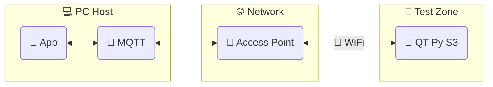

# QT Py Datalogger

**`qtpy-datalogger`** -- A remote control and data acquisition system using the [Adafruit QT Py S3] and [CircuitPython]

## Documentation

Available at [downtothewire.io/**qtpy-datalogger/welcome**]

## Status

[](https://github.com/wireddown/qtpy-datalogger/actions/workflows/ci.yml)
[![Dependabot Updates]](https://github.com/wireddown/qtpy-datalogger/actions/workflows/dependabot/dependabot-updates)
[](https://github.com/wireddown/qtpy-datalogger/actions/workflows/publish.yml)

## [Structure](https://github.com/wireddown/qtpy-datalogger#structure)



The PC host controls and communicates with any number of sensor nodes on the wireless network.

## Preview in 90 seconds

1. Connect your QT Py device with USB
    - _(Optional)_ Back up its `code.py` file
1. Preview the program in a deletable Python virtual environment
    ```pwsh
    # Create and enter a new Python virtual environment
    mkdir qtpy-preview
    cd qtpy-preview
    python -m venv --upgrade-deps .venv
    .\.venv\Scripts\activate.ps1

    # Install
    pip install qtpy-datalogger

    # Show the package help
    qtpy-datalogger --help

    # Search for devices
    qtpy-datalogger connect --discover-only

    # Install the sensor node runtime the device
    qtpy-datalogger equip

    # Open a serial connection, use Ctrl-] to quit
    qtpy-datalogger connect

    qtpycmd get_apps

    qtpycmd stats

    qtpycmd read A0 A1 A2 A3

    # Ctrl-] to quit
    ```
1. Plot data in the [**Analog Plotter**] demo GUI app

1. Optionally, delete the folder `qtpy-preview` when you are done

**_Note:_** This preview does not demonstrate MQTT communication over WiFi

In order to communicate on the WiFi network, the QT Py sensor node must also have

- an MQTT broker
- WiFi credentials

Visit the [MQTT setup] page for more details if you want to try [the demo apps] over the network.

## Gallery

In addition to the command line tools, the `qtpy-datalogger` package includes these GUI apps.

### Scanner

```
qtpy-datalogger run scanner
```

Scan for nodes by group.
Select a node to send it messages.


### Data Viewer

```
qtpy-datalogger run data-viewer
```

Open a CSV file for time series data.


CSV format

- Series data are in columns
- Series names are in the first row
- The time axis is in the first column
    - ISO timestamps and floating point values both accepted

```csv
Time,Sensor 1,Sensor 2
0.0,1.284,2.713
0.22,1.302,5.536
...
```

## Supported systems

**Supported Python versions**

- Host
    - Python 3.11
    - Python 3.12
    - Python 3.13
- Node
    - CircuitPython 9.x

**Supported host platforms**

- Windows

**Supported connection types**

- Serial / UART
- Network / MQTT

**Entry points**

- Host program: [`qtpy_datalogger/console.py`](https://github.com/wireddown/qtpy-datalogger/blob/main/src/qtpy_datalogger/console.py)
- QT Py program: [`qtpy_datalogger/sensor_node/code.py`](https://github.com/wireddown/qtpy-datalogger/blob/main/src/qtpy_datalogger/sensor_node/code.py)

## Questions and help

Please go to the [Welcome] page for questions and help.

## Contributing

This project manages its Python package with `uv`.

The environment setup instructions are on the [Develop] page.

The design documentation is in the wiki under the [Design Doc] pages.

## Legacy system

This project replaces a legacy system that uses Python and JeeNodes.

See the [summary and source code] in the `docs/legacy` folder for details.


[Dependabot Updates]: https://github.com/wireddown/qtpy-datalogger/actions/workflows/dependabot/dependabot-updates/badge.svg

[Adafruit QT Py S3]: https://learn.adafruit.com/adafruit-qt-py-esp32-s3
[CircuitPython]: https://circuitpython.org/
[downtothewire.io/**qtpy-datalogger/welcome**]: https://downtothewire.io/qtpy-datalogger/welcome/

[**Analog Plotter**]: https://wireddown.github.io/qtpy-datalogger/customize/#analog-plotter
[MQTT setup]: https://wireddown.github.io/qtpy-datalogger/eng/intro/mqtt/
[the demo apps]: https://wireddown.github.io/qtpy-datalogger/customize/

[Welcome]: https://wireddown.github.io/qtpy-datalogger/welcome/
[Develop]: https://wireddown.github.io/qtpy-datalogger/develop/
[Design Doc]: https://github.com/wireddown/qtpy-datalogger/wiki/Design-Doc-1-Overview
[summary and source code]: https://github.com/wireddown/qtpy-datalogger/blob/main/docs/legacy/README.md
