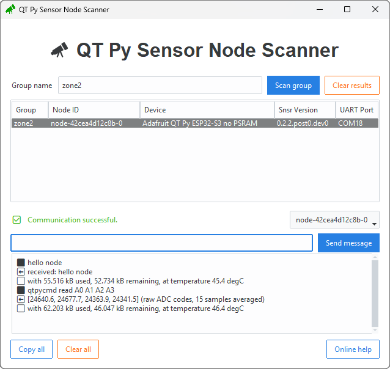
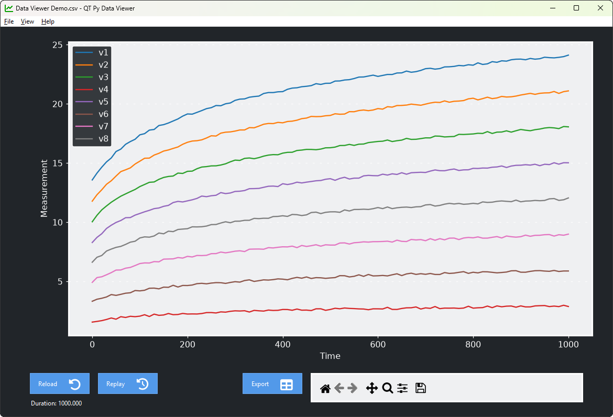

# Gallery

## Scanner

```
qtpy-datalogger run scanner
```

Scan for sensor nodes by group.
Select a sensor node to send it messages.



## Data Viewer

```
qtpy-datalogger run data-viewer
```

Open a CSV file for time series data.



CSV format

- Series data are in columns
- Series names are in the first row
- The time axis is in the first column
    - ISO timestamps and floating point values both accepted

```csv title="datalog.csv"
Time,Sensor 1,Sensor 2
0.0,1.284,2.713
0.22,1.302,5.536
...
```
