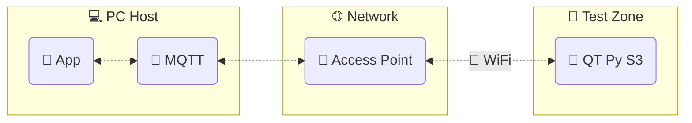

---
hide:
  - navigation
  - toc
---

# QT Py Datalogger

**`qtpy-datalogger`** -- A remote control and data acquisition system using the [Adafruit QT Py S3] and [CircuitPython].

## Remote control and data acquisition

The PC host controls and communicates with any number of sensor nodes on the wireless network.

## Complete and custom

-   :fontawesome-solid-microchip:{ .middle }&nbsp; __Use every subsystem__

    ---

    Read and write both **analog** and **digital** pins. Control **SPI** and **I^2^C** peripherals. Blink the **NeoPixel**!

    :octicons-arrow-right-24: [Features](/features)

-   :lucide-square-activity:{ .lg .middle }&nbsp; __Adapt to any use case__

    ---

    Use the app API to deploy custom code for remote acquisition and control.

    :octicons-arrow-right-24: [Customize](/customize)

-   :fontawesome-solid-image:{ .middle }&nbsp; __GUI applications__

    ---

    Includes built-in GUI applications for detecting sensor nodes and viewing data.

    :octicons-arrow-right-24: [Gallery](/gallery)

-   :material-clock-fast:{ .lg .middle }&nbsp; __Set up in 5 minutes__

    ---

    Install `qtpy-datalogger` with `pip` and get up and running in minutes.

    :octicons-arrow-right-24: [Get started](/get-started)

## Questions and help

Please go to the [wiki home page] for guidance.

[Adafruit QT Py S3]: https://learn.adafruit.com/adafruit-qt-py-esp32-s3
[CircuitPython]: https://circuitpython.org/
[wiki home page]: https://github.com/wireddown/qtpy-datalogger/wiki
