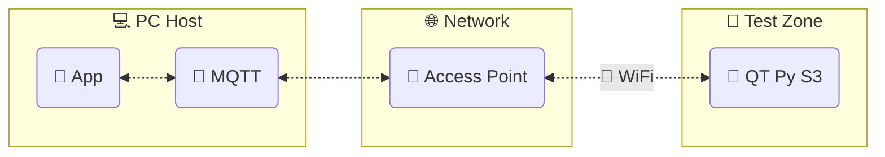
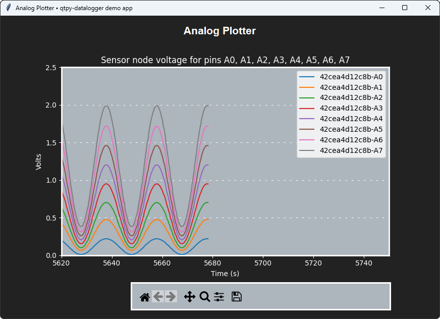

---
hide:
  - navigation
  - toc
---

# QT Py Datalogger

**`qtpy-datalogger`** -- A remote control and data acquisition system using the [Adafruit QT Py S3] and [CircuitPython].

## Remote control and data acquisition

The PC host controls and communicates with any number of sensor nodes on the wireless network.

[Preview in 5 minutes &nbsp;:lucide-cable:{ .lg .middle }](get-started/){ .md-button .md-button--primary }

## Complete and custom

-   :fontawesome-solid-microchip:{ .lg .middle .qtpy }&nbsp; __Use every subsystem__

    ---

    Read and write both **analog** and **digital** pins. Control **SPI** and **I^2^C** peripherals. Blink the **NeoPixel** :lucide-siren:{ .🦜 }

    :octicons-arrow-right-24: [Features](features/)

-   :lucide-square-activity:{ .lg .middle .qtpy }&nbsp; __Adapt to any use case__

    ---

    Use the app API to deploy custom code for remote acquisition and control.

    :octicons-arrow-right-24: [Customize](customize/)

-   :lucide-chart-spline:{ .lg .middle .qtpy }&nbsp; __GUI applications__

    ---

    Includes built-in GUI applications for detecting sensor nodes and viewing data.

    :octicons-arrow-right-24: [Gallery](gallery/)

-   :lucide-zap:{ .lg .middle .qtpy }&nbsp; __Preview in 5 minutes__

    ---

    Install `qtpy-datalogger` with `pip` and get up and logging in minutes.

    :octicons-arrow-right-24: [Get started](get-started/)

## Questions and help

Please go to the [Welcome](welcome/) page for questions and help.

[Adafruit QT Py S3]: https://learn.adafruit.com/adafruit-qt-py-esp32-s3
[CircuitPython]: https://circuitpython.org/
